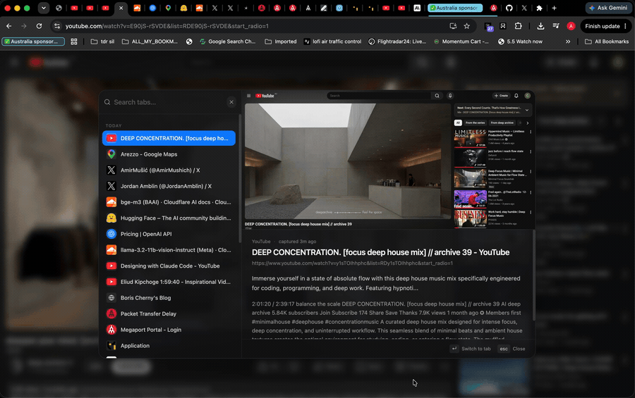
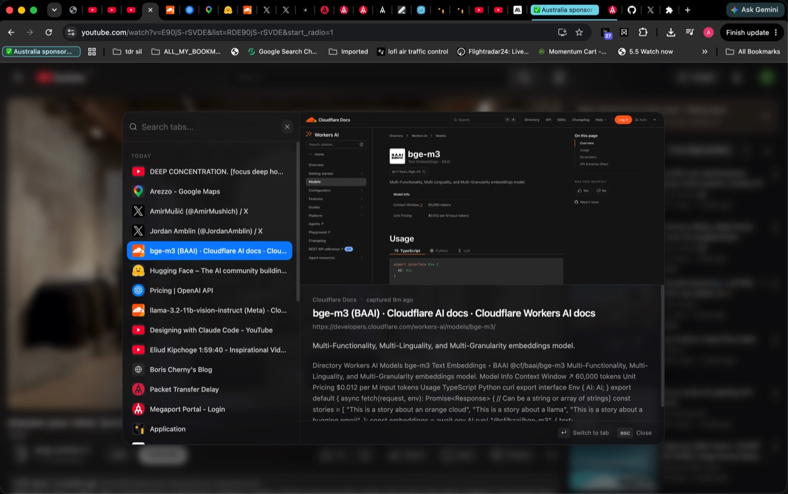
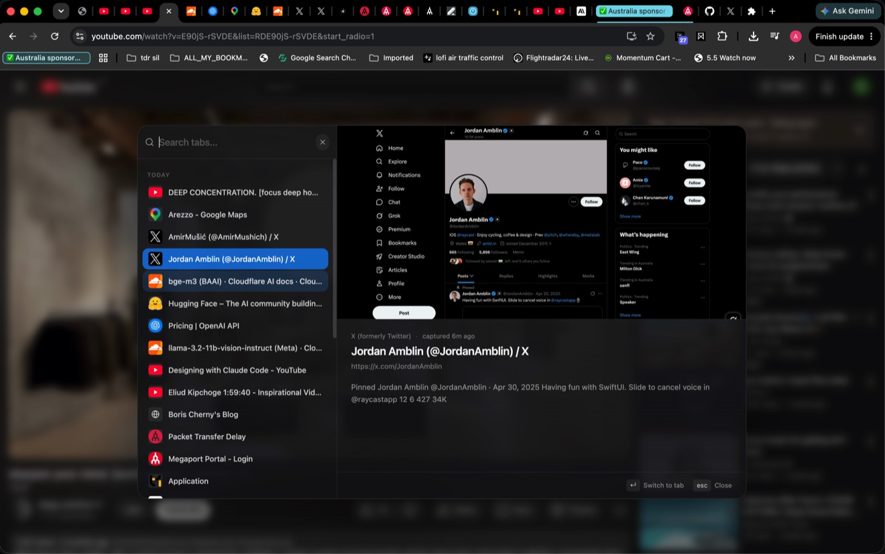

<div align="center">


# TabKnight

**Keyboard-first tab navigation for Chrome — search, preview, and switch tabs without ever leaving the page.**

[](https://developer.chrome.com/docs/extensions/mv3/intro/)
[](https://bun.sh/)
[](https://www.typescriptlang.org/)
[](https://react.dev/)
[](https://tailwindcss.com/)
[](./LICENSE)
[](./changelog.mdx)

</div>

---

TabKnight turns Chrome's tab strip into a fast, keyboard-driven command surface. Hit one shortcut and a glassmorphic palette appears **over your current page** — fuzzy-search every tab in every window, see a real preview of where you're going, and jump there with `Enter`. When you're done, save a working set of tabs as a bookmark-backed session and restore it later.

It's local-first (everything lives in your browser, zero network calls), and it degrades gracefully even on Chrome's own internal pages.

<div align="center">


<sub>The <code>⌘K</code> overlay floats over your current page — fuzzy-search every tab, preview where you're headed, and jump there with <kbd>Enter</kbd>.</sub>

</div>

## ⌨️ Keyboard shortcuts

TabKnight is keyboard-first by design — you rarely need the mouse.

**Global**

| Shortcut | Action |
| --- | --- |
| `⌘ K` (macOS) · `Ctrl Shift K` (Win/Linux) | Open the tab-preview overlay on the current page |

> Rebind it anytime at `chrome://extensions/shortcuts`.

**Inside the overlay / navigator**

| Shortcut | Action |
| --- | --- |
| `↑` · `↓` | Move the selection |
| `Enter` | Switch to the selected tab (or open the typed query) |
| `Esc` | Close and return to your page |
| _type…_ | Filter instantly — the search stays focused even if focus drifts |
| `Backspace` | Edit the query without clicking back into the input |

**Popup — save flow**

| Shortcut | Action |
| --- | --- |
| `Enter` | Save the selected tabs |
| `⌘ A` · `Ctrl A` | Select all |
| `Esc` | Close the popup |

## ✨ Features

### 🎯 Tab-preview overlay — the flagship

Press `⌘ K` and a command palette blends in over the current page; you never get bounced to a new tab.

<div align="center">



<sub>Arrow through tabs and the preview updates live — switch with <kbd>Enter</kbd>, dismiss with <kbd>Esc</kbd>.</sub>

</div>

- **Live fuzzy search** across every open tab in **every window** — matches title and URL.
- **Tiered, never-blank previews.** Each result renders the best tier available *right now* and upgrades in place — no spinners, no empty panes:
  - **Tier 0** — favicon + title (instant, always).
  - **Tier 1** — rich card from page metadata (`og:image`, site name, description).
  - **Tier 2** — a real pixel thumbnail of the page, captured in the background.
- **Recency-grouped list** when you're not searching, so your most-relevant tabs are one glance away.
- **Auto-scroll** keeps the active row comfortably in view as you arrow through results.

<table>
  <tr>
    <td width="50%" valign="top">
      
      <br /><sub>A live page thumbnail for the highlighted tab — title, URL, and a snippet right beside it.</sub>
    </td>
    <td width="50%" valign="top">
      
      <br /><sub>Rich metadata card when there's no thumbnail yet — it upgrades in place, never blank.</sub>
    </td>
  </tr>
</table>

### 🪟 Cross-window search & switch

Results span all of your Chrome windows. Selecting a tab focuses its destination window first, then activates it — a clean, stable jump even across displays.

### 🔎 Query-to-open

No match for what you typed? `Enter` opens it directly — as a URL if it looks like one, otherwise as a search in a fresh tab.

### 🔖 Bookmark-backed sessions

From the popup, treat a pile of tabs as a session:

- **Save** the current tabs into a bookmark folder — grouped by domain, bulk-selectable, with smart date-named folders.
- **Close** them in bulk right after saving (with a "copy all URLs" escape hatch).
- **Restore** any saved folder to reopen the whole set in one click.

### 🛡️ Works everywhere — even on `chrome://` pages

Chrome blocks extensions from injecting UI into its own internal pages (`chrome://extensions/`, `chrome://settings/`, …). On those — and on strict-CSP sites — TabKnight falls back to a temporary tab opened **in the same window**, using a blurred screenshot of your origin page as the backdrop (with halftone + vignette) so it still feels in-context. It self-cleans and returns focus to your page on `Esc`.

## 🧠 Under the hood

The capabilities that make it feel instant and reliable:

- **In-page without the mess.** The overlay is a content-script **shadow-DOM host** that paints a blurred backdrop, with an **extension-origin `<iframe>`** hosting the React panel. The shadow root isolates it from arbitrary site CSS; the iframe origin gives the panel direct IndexedDB access. If the iframe can't load (strict CSP), it falls back to the standalone tab.
- **Snapshot pipeline — page → background → IndexedDB.** Content scripts can't reach the extension DB directly, so the content script *harvests* lightweight content cards (title, `og:*`, theme color, a short text excerpt) and messages them to the background service worker, which persists them to **IndexedDB** keyed by a normalized-URL hash.
- **Real thumbnails, politely captured.** The active tab is screenshotted via `chrome.tabs.captureVisibleTab`, downscaled to **WebP**, and stored as a blob. Captures are **throttled per-tab and serialized globally** to respect Chrome's rate limits, and the store is **LRU-evicted** so it never grows unbounded.
- **Local-first & private.** Everything lives in IndexedDB under `unlimitedStorage`. No servers, no accounts, no telemetry.
- **Predictable ranking.** Results use a fast, transparent heuristic — exact-title beats prefix beats substring, URL matches contribute, active/pinned tabs get a small boost, and ties resolve toward the current window.
- **Clean React core.** State via React Context + hooks; every Chrome API call is wrapped async/await in a single `chrome-api.ts` layer.

## 🔐 Permissions

Declared in [`public/manifest.json`](public/manifest.json) — each maps to a real feature:

| Permission | Why it's needed |
| --- | --- |
| `tabs` | Enumerate, activate, create, and close tabs; read titles/URLs/favicons |
| `bookmarks` | Save and restore tab sets as bookmark folders |
| `activeTab` | Operate on the current page for overlay injection and capture |
| `windows` | Focus the destination window during cross-window switching |
| `scripting` | (Re)inject the content script on supported pages |
| `storage` | Hand off context between the background worker and the fallback UI |
| `unlimitedStorage` | Room for the IndexedDB snapshot + thumbnail store |
| `host_permissions: <all_urls>` | Run the overlay and capture previews on the sites you visit |

## 🧰 Tech stack

- **Bun** — bundler & runtime
- **TypeScript** (strict mode)
- **React 18**
- **Tailwind CSS** + **shadcn/ui** (Mira style)
- **Chrome Extension — Manifest V3** (service worker + content script)

## 🚀 Getting started

**Prerequisites:** [Bun](https://bun.sh/) and Google Chrome.

```bash
# install dependencies
bun install

# production build  →  ./dist
bun run build

# watch mode (rebuilds on change)
bun run dev

# type-check
bun run typecheck
```

### Load the unpacked extension

1. Open `chrome://extensions/`
2. Enable **Developer mode** (top-right)
3. Click **Load unpacked**
4. Select the generated **`dist/`** folder
5. After any code change, rebuild and click **Reload** on the extension card

## 🗺️ Project structure

```
tabknight/
├─ public/
│  ├─ manifest.json            # MV3 manifest — permissions, command, icons
│  └─ icons/                   # tabknight_icon.png (source) + icon16/32/48/128
├─ src/
│  ├─ background/index.ts      # service worker: command routing, capture, badge, fallback
│  ├─ content/index.ts         # shadow-DOM overlay host + content harvester + CSP fallback
│  └─ popup/
│     ├─ App.tsx               # view router (overlay / standalone / popup)
│     ├─ views/                # TabPreview · TabNavigator · SaveTabs · CloseTabs · Restore
│     ├─ components/           # tab list, domain groups, folder picker, shadcn/ui
│     ├─ hooks/                # useTabs, useBookmarks, useTabSelection, useKeyboardShortcuts
│     └─ lib/
│        ├─ chrome-api.ts      # async wrappers around Chrome APIs
│        └─ preview/           # harvester · db (IndexedDB) · thumbnail · hash
├─ config/build.ts            # Bun build orchestration
├─ docs/screenshots/         # README imagery (overlay, previews, demo gif)
└─ changelog.mdx              # release history
```

## 🔢 Versioning

Semantic versioning while in `0.x`. Every shipped fix or feature bumps the version in **both** `package.json` and `public/manifest.json` (kept in sync), in the same commit as the change. See [`changelog.mdx`](changelog.mdx).

## 📄 License

[MIT](./LICENSE) © 2025 Aitor Gallardo
